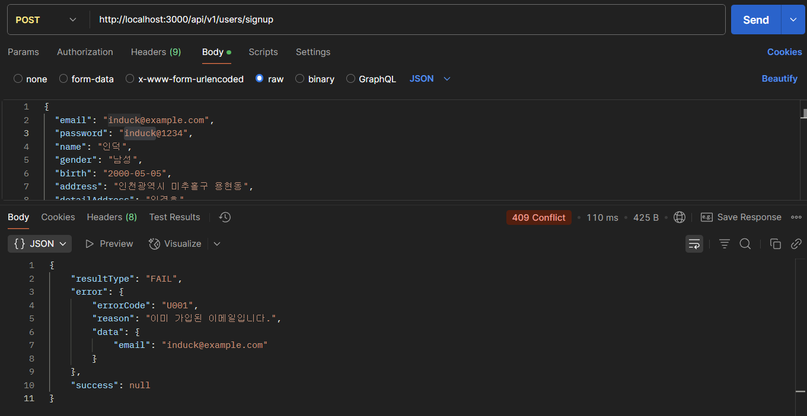
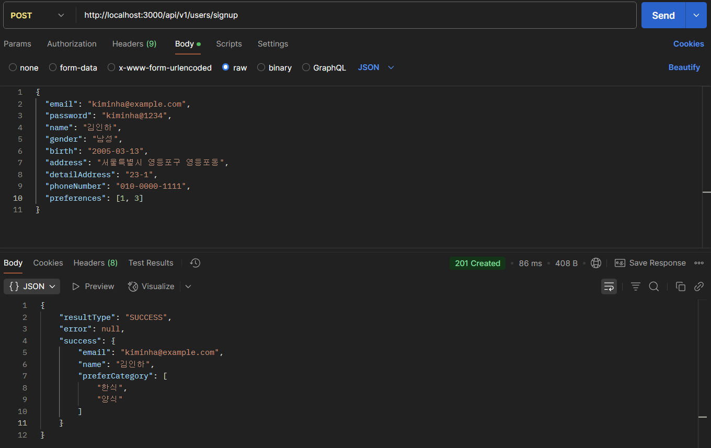
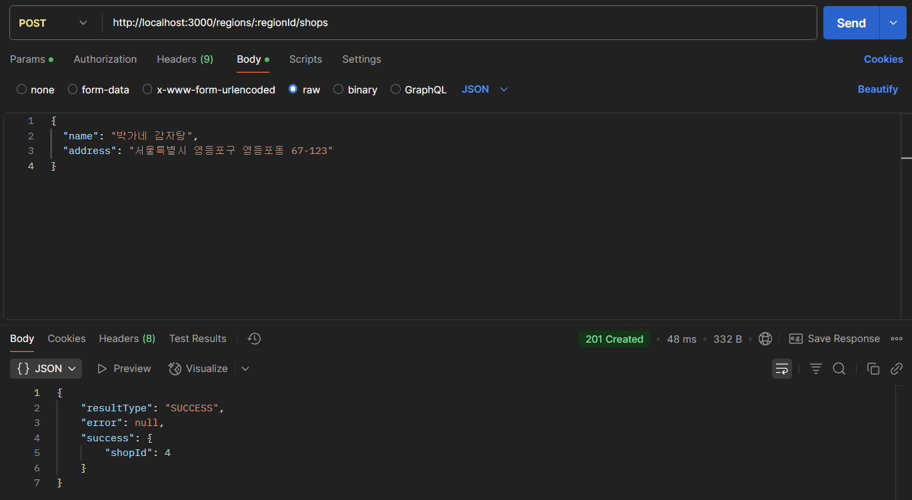
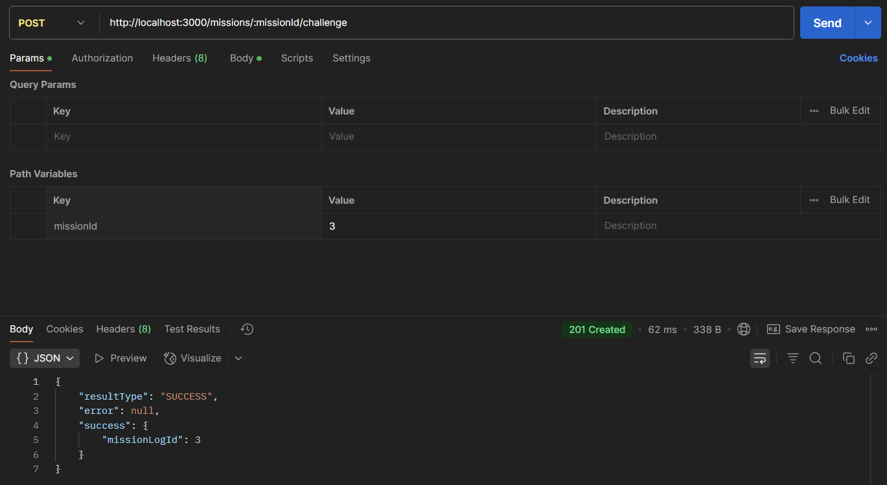
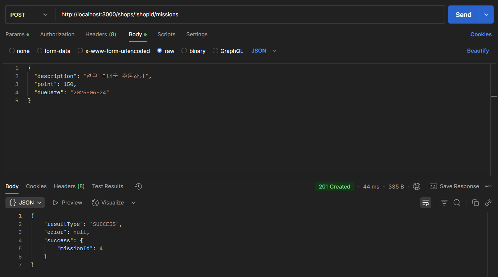

-- github 링크
https://github.com/gaaahee/8th_node.js_practice/tree/feature/chapter-07

1. 회원가입 API
    - 회원가입 - 이메일 중복 에러 처리
        
        
        
    - 회원가입 - 성공
        
        
        

---

- 지역별 상점 추가하기 - 성공
    
    
    

---

미션 API

- 미션 도전하기 - 에러 처리
    
    
    
- 미션 도전하기 - 성공
    
    
    
- 미션 추가하기 - 성공
    
    
    

---

리뷰 API

- 리뷰 생성하기 - 성공
    
    
    