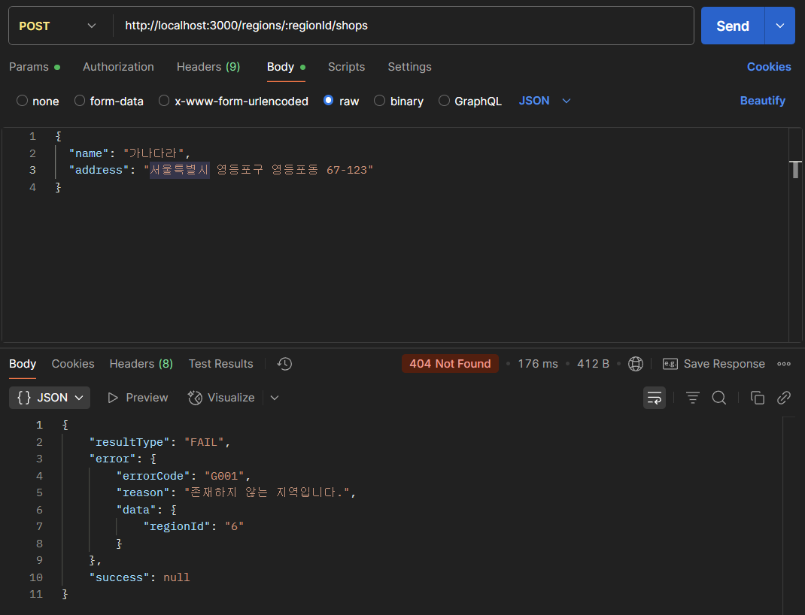
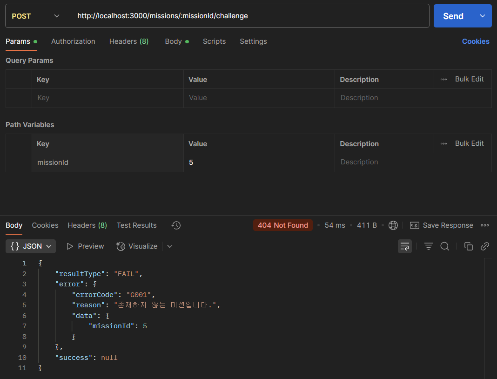
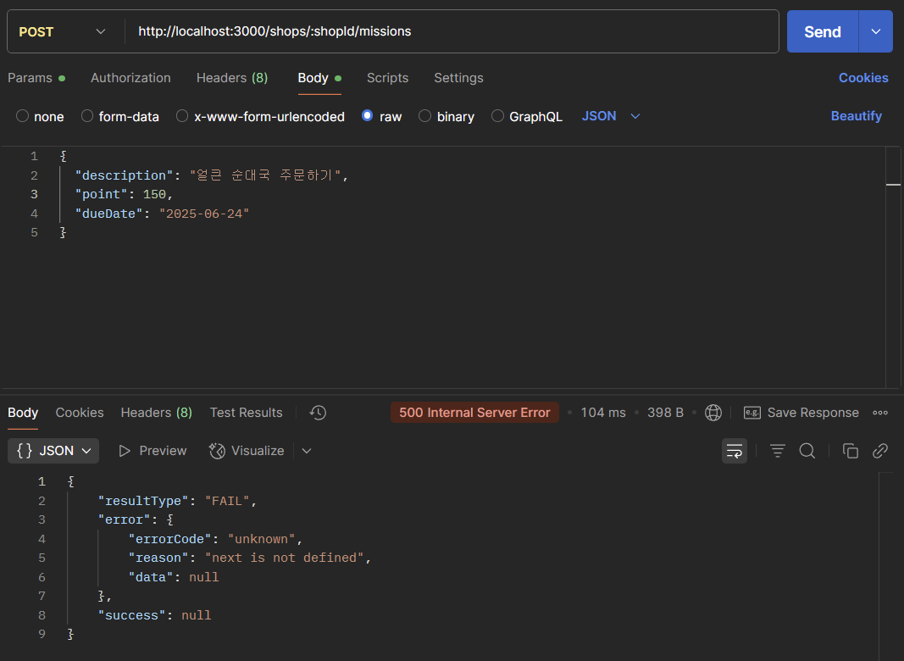
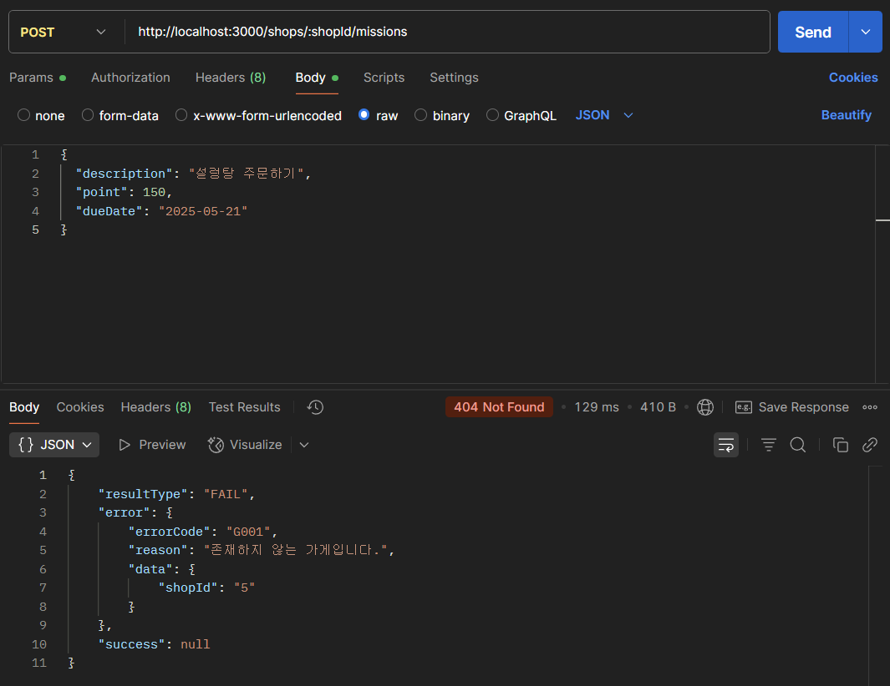
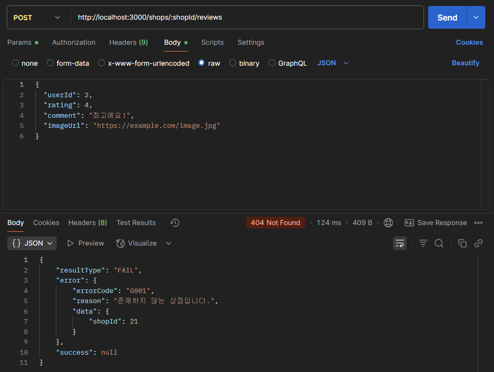
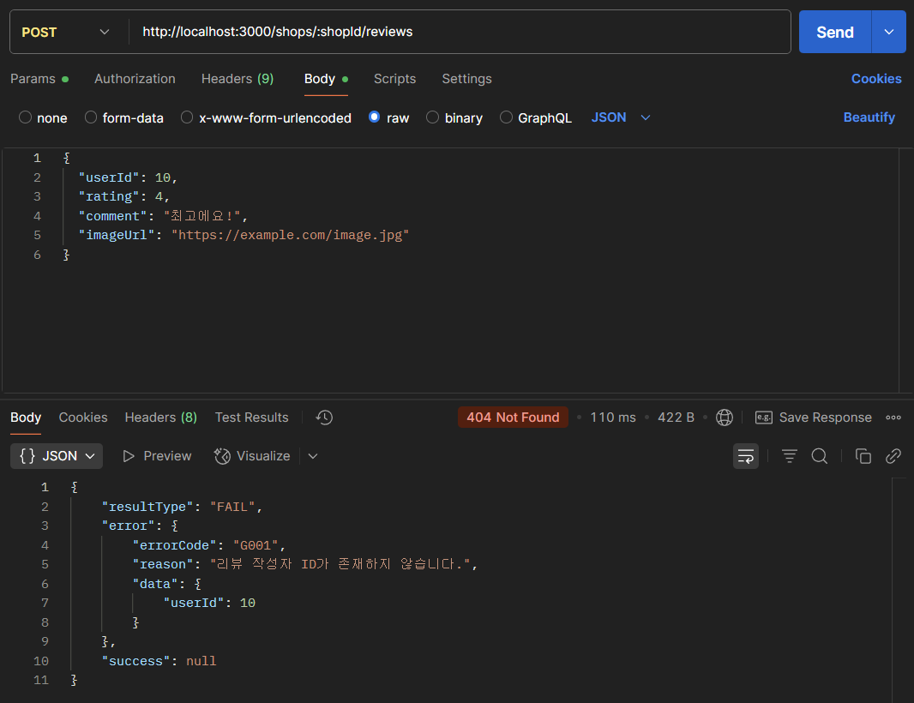
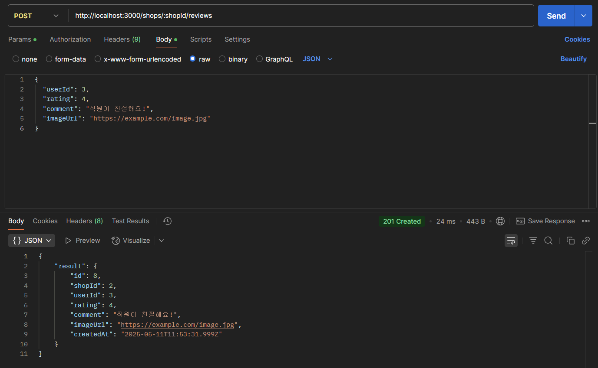

-- github 링크
https://github.com/gaaahee/8th_node.js_practice/tree/feature/chapter-07

1. 회원가입 API
    - 회원가입 - 이메일 중복 에러 처리
        
        
        
    - 회원가입 - 성공
        
        
        

---

2. 상점 추가 API
    - 지역별 상점 추가하기 - 존재하지 않는 지역

        

    - 지역별 상점 추가하기 - 성공
    
        
    

---

3. 미션 API

    - 미션 도전하기 - 500 Internal Server Error
        
        
        
    - 미션 도전하기 - 존재하지 않는 미션

        

    - 미션 도전하기 - 성공
        
        

    - 미션 추가하기 - 500 Internal Server Error

        

    - 미션 추가하기 - 존재하지 않는 가게

        
        
    - 미션 추가하기 - 성공
        
        
   
        
    ---

4. 리뷰 API

    - 리뷰 생성하기 - 존재하지 않는 상점
        
        

    - 리뷰 생성하기 - 리뷰 작성자 ID가 존재하지 않음
        
        

    - 리뷰 생성하기 - 성공
        
        